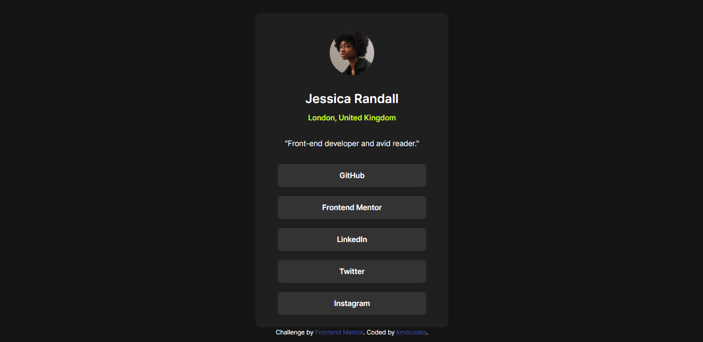
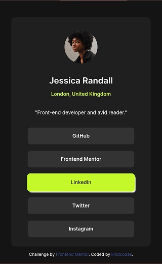

# Frontend Mentor - Social links profile solution

This is a solution to the [Social links profile challenge on Frontend Mentor](https://www.frontendmentor.io/challenges/social-links-profile-UG32l9m6dQ). Frontend Mentor challenges help you improve your coding skills by building realistic projects. 

## Table of contents

- [Overview](#overview)
  - [The challenge](#the-challenge)
  - [Screenshot](#screenshot)
  - [Links](#links)
- [My process](#my-process)
  - [Built with](#built-with)
  - [What I learned](#what-i-learned)
  - [Continued development](#continued-development)
  - [Useful resources](#useful-resources)
- [Author](#author)


**Note: Delete this note and update the table of contents based on what sections you keep.**

## Overview

### The challenge

This is a Frontend Mentor challenge on HTML and CSS that deals with designing a social media link card. It is aimed at testing one's skill on how to create responsive webpages with both hover and focus effects set.

Here I decided to approach this challenge adding my own style of hover and focus effects while also trying my possible best to ensure it replicates the original design. This was accomplished with ease as I made use of Grid Layout and also did a little bit of improvisaation. 

Feel free to go through the code and immerse yourself in it.

### Screenshot





### Links

- Solution URL: [GitHub](https://github.com/kmdcodes/social-links-profile-main))
- Live Site URL: [GitHub Pages](https://kmdcodes.github.io/social-links-profile-main/#)

## My process

### Built with

- Semantic HTML5 markup
- CSS custom properties
- Flexbox
- CSS Grid

### What I learned

I learnt  newer ways to place components on the center of the page without having to think and spent more time calculating positioning of the component. This was done using the following css code:

```css
.body-container{
    display : grid;
    place-items : center;
    height: 100vh;
}
```

I also learnt and experimented how to separate my css files into two different files (variables.css and style.css). One of the file contains the custom styles like variable and the custom fonts and the other file to contain the main the main styles of the page.

As stated above, I also learnt how to effectively **utilise custom properties** and **implement custom fonts too**.

Also, I learnt how to better use the hover and focus pseudo-selectors and also how to apply them to the <li> tag contents.


### Continued development

I did experiment a little on adding transitions to an element to make changing of statess smoother, though not as deep as I would have loved to. Hence, this is one area I would love to study and develop one and probably implement better on my next challenge.

### Useful resources

- [Microsoft Copilot](https://copilot.microsoft.com/) - This tool as always, was of tremendous use to me and the completion of the challenge as it acts as a partner and support when I run out of ideas from trying to figure out to do a certain task or my brainstorming hits rock bottom. It acts as a tool to help reawakening my creativity and productivity by helping me answer questions concerning confusing areas. I recommend you make use of Microsoft Copilot too. Its a great tool.
- [CSS Custom Fonts](https://www.w3schools.com/css/css3_fonts.asp) - This is an amazing article which helped me understand the concept and application of custom fonts in CSS


## Author
K.M. Daniel
- Frontend Mentor - [@kmdcodes](https://www.frontendmentor.io/profile/kmdcodes)
- Twitter - [@kmdbank](https://x.com/kmdbank)
- Facebook - [@kmdbank](https://facebook.com/kmd4life)

